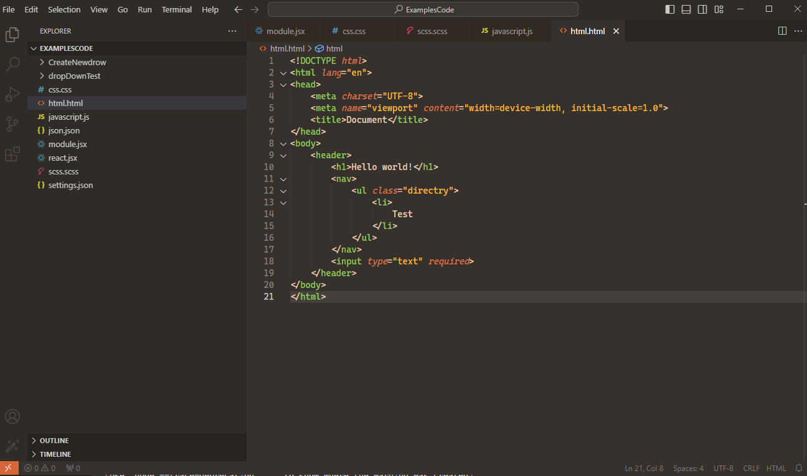
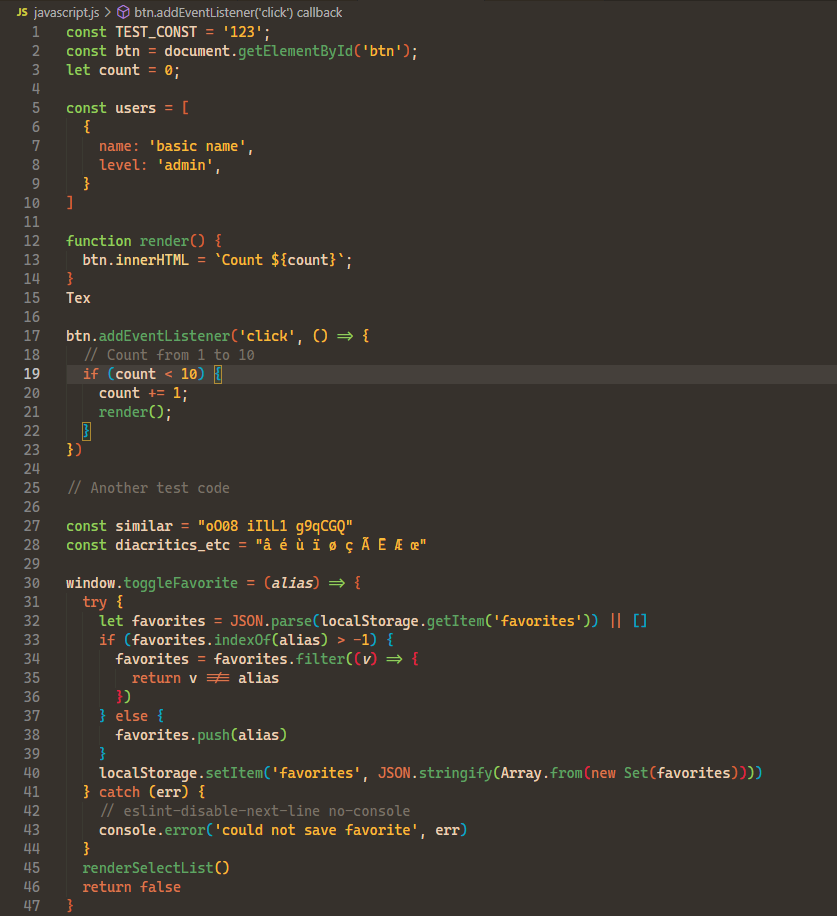
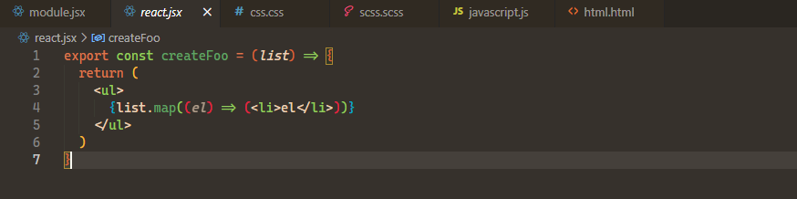
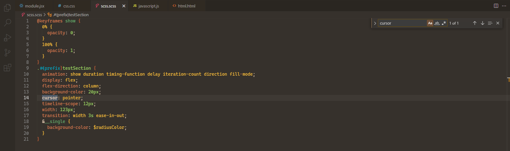
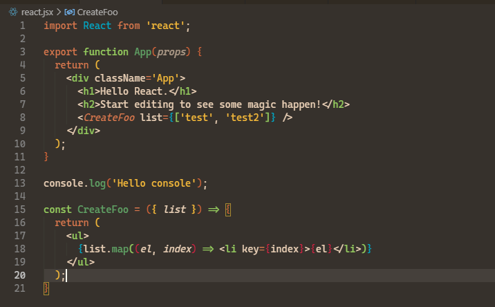

# codesongnew

Fork of Connor Peet codesong theme with new improvements for VS Code

> [!IMPORTANT]  
> Recommended for use with Cascadia Code font 

> [!NOTE]  
> Tested for the use of css, js (did not check and changed the work with classes), scss, jsx (not very much)

> [!CAUTION]
> Work is currently underway to provide additional syntax coloring for React
> 